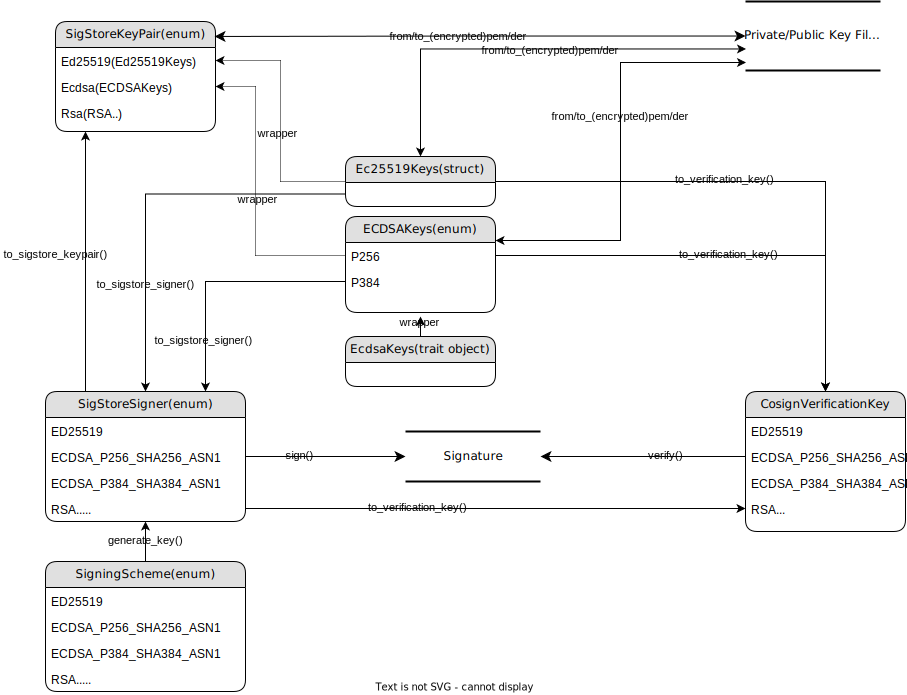

# Example Key Interface

This is a simple example program that shows how to use the key interfaces.
The key interfaces covers:
* Generating Asymmetric encryption key pair
* Signing with private key
* Exporting the (encrypted) private/public key
* Importing the (encrypted) private/public key
* Verifying signature with public key

The basic implementation for key-interface can be shown in the following diagram



The exposed interfaces (marked as `pub`) include:
* `SigStoreSigner` enum: wrapper for `Signer`s of different kinds of signing algorithm.
* `SigStoreKeyPair` enum: wrapper for `KeyPair`s of different kinds of asymmetric encryption algorithm.
* `SigningScheme` enum: Different kinds of signing algorithm.
* `CosignVerificationKey` struct: Public key types to verify signatures for different signing algorithm.

To show the different usages for them, there will be three typical scenarios.

## Key Pair Generation, Signing and Verification

This example shows the following operations

* Generating Asymmetric encryption key pair due to given `SigningScheme`.
* Signing the given test data using private key. The signature will be printed
in hex.
* Verifying the signature generated.

The signing process is performed by `SigStoreSigner`.
The verifying process is performed by `CosignVerificationKey`.

### Run the example case

The following example will create a ECDSA_P256_ASN1 keypair and sign the given
data.

```bash
cargo run --example key_pair_gen_sign_verify
```

This example includes the following steps:

* Randomly generate an `ECDSA_P256_ASN1` key pair, which is represented as `signer` of type
`SigStoreSigner` and includes a private key and a public key. Here, the type of the key
pair is influenced by the given `SigningScheme`.
* Sign the given data `DATA_TO_BE_SIGNED` using the `signer`'s private key.
* Derive [`verification_key`](../../src/crypto/verification_key.rs) from the `signer`.
* Verify the signature generated before using the `verification_key`.

## Key Pair Generation and Exporting

This example shows the following operations

* Generating Asymmetric encryption key pair due to given `SigningScheme`.
* Export the public key in both DER and PEM format.
* Export the private key in both DER and PEM format.
* Export the encrypted private key in PEM format.

The key-related operations are performed by `SigStoreKeyPair`.

### Run the example case

The following example will create a ECDSA_P256_ASN1 keypair and sign the given
data.

```bash
cargo run --example key_pair_gen_and_export
```

This example includes the following steps:

* Randomly generate an `ECDSA_P256_ASN1` key pair, which is represented as `signer` of type
`SigStoreSigner` and includes a private key and a public key. Here, the type of the key
pair is influenced by the given `SigningScheme`.
* Export the public key in PEM format and DER format. The result
will be printed (PEM as string, DER as hex).
* Export the private key in PEM format and DER format. The result
will be printed (PEM as string, DER as hex).
* Export the encrypted private key in PEM format. The result
will be printed.

## Key Pair Importing

This example shows the following operations

* Import the public key in both DER and PEM format to `CosignVerificationKey`.
* Import the private key in both DER and PEM format to `SigStoreKeyPair/ECDSAKeys`.
* Import the encrypted private key in PEM format to `SigStoreKeyPair/ECDSAKeys`.
* Convert the `SigStoreKeyPair` to `SigStoreSigner`.

### Run the example case

The following example will create a ECDSA_P256_ASN1 keypair and sign the given
data.

```bash
cargo run --example key_pair_import
```

This example includes the following steps:

* Import the public key `ECDSA_P256_ASN1_PUBLIC_PEM.pub` as `CosignVerificationKey`.
* Import the public key `ECDSA_P256_ASN1_PUBLIC_DER.pub` as `CosignVerificationKey`.
* Import the private key `ECDSA_P256_ASN1_PRIVATE_PEM.key` as `SigStoreKeyPair`.
* Import the private key `ECDSA_P256_ASN1_PRIVATE_PEM.key` as `ECDSAKeys`.
* Import the private key `ECDSA_P256_ASN1_PRIVATE_DER.key` as `SigStoreKeyPair`.
* Import the private key `ECDSA_P256_ASN1_PRIVATE_DER.key` as `ECDSAKeys`.
* Import the encrypted private key `ECDSA_P256_ASN1_ENCRYPTED_PRIVATE_PEM.key` as `SigStoreKeyPair`.
* Import the encrypted private key `ECDSA_P256_ASN1_ENCRYPTED_PRIVATE_PEM.key` as `ECDSAKeys`.
* Convert the last `SigStoreKeyPair` to `SigStoreSigner`.
